# QA Report: Mercury Translate v0.1.1

| Field | Value |
|-------|-------|
| **Date** | 2026-08-20 |
| **Target** | Chrome 151.0.7922.140, locally installed Mercury Translate 0.1.1 |
| **Branch** | `codex/chrome-web-store-v0-1-1-reuse` |
| **Commit** | `6fa8479` (2026-08-20) |
| **PR** | — |
| **Tier** | Standard |
| **Scope** | Webpage bilingual translation, selection UI, dynamic DOM, Shadow DOM, YouTube subtitles, PDF reader, image OCR, local privacy boundary, retry/cancel |
| **Duration** | 约 5 小时（含缺陷修复、重建与真实浏览器复测） |
| **Pages visited** | 15 个测试页面或关键视图 |
| **Screenshots** | 24 张已检查的证据截图 |
| **Framework** | Chrome MV3 extension, WXT, Vue 3 |

## Health Score: 78.4 → 99.9

基线分数包含 6 个 medium 功能、隐私体验或性能问题、1 个 low 内容问题，以及取消联网后每秒刷新的控制台警告。修复并复测后，唯一保留项是 Standard 档按规则延期的 low 内容问题（OCR 语言包大小缺少数字）。

## Test Matrix

| Area | Status | Evidence |
|------|--------|----------|
| YouTube direct-load subtitles | Pass | Original and local Chinese subtitles render together; no console warnings/errors. |
| YouTube SPA navigation | Pass after fix | 搜索结果 → 视频的站内跳转无需刷新即可挂载 Mercury 字幕按钮和菜单；无 Mercury 控制台错误。 |
| YouTube network-consent cancellation | Pass after fixes | 多条并发字幕共享一个待决选择；取消一次后继续播放十五秒没有再次弹窗，也没有新增 Mercury 警告（ISSUE-005、ISSUE-007）。 |
| Webpage translation | Pass | Chrome 本地翻译在 HTTPS 页面与本地夹具上生成双语结果，恢复原文成功。 |
| Dynamic DOM / Shadow DOM | Pass | 初始、自动插入、点击后插入及 open Shadow DOM 文本均成功翻译。 |
| Selection translation | Pass | 选中文字后出现入口，结果浮层显示原文与本地中文译文，并可关闭。 |
| PDF reader | Pass after fix | 网络、本地、嵌入、POST PDF、回退、滚动与本地翻译通过；Google 取消只询问一次并保留已有译文（ISSUE-004）。 |
| Image OCR | Pass after fixes | 缺少模型时安全失败；推荐语言包正常下载；清晰英文图片在十秒内完成本地 OCR 与翻译（ISSUE-003、ISSUE-006）。 |
| Privacy / failure recovery | Pass | 本地模式无联网发送；Google 始终在发送前阻断；PDF 与字幕都只询问一次并正确处理取消。 |

## Console Health

初始 YouTube 直接加载没有扩展相关错误。ISSUE-007 修复前，取消联网后 43 秒产生 100 条重复 `NetworkConsentRequiredError` warning；修复后从点击“取消”起继续播放十五秒，当前标签页新增日志为 0。开发期间主动重新加载扩展时，旧 content script 曾短暂产生两条 `Extension context invalidated`，刷新测试页后即消失，不属于正常用户流程。

## Issues

Issues are recorded immediately after a twice-confirmed reproduction.

### ISSUE-001: YouTube 站内跳转不会启动字幕翻译

| Field | Value |
|-------|-------|
| **Severity** | medium |
| **Category** | functional |
| **URL** | `https://www.youtube.com/watch?v=eSaXc-NOAQI&t=318s` |

**Description:** 从 YouTube 搜索结果点击视频属于正常的单页应用导航。预期 Mercury 字幕按钮、菜单和译文层随视频页面挂载；实际三者均不存在，只有刷新页面后才恢复。该行为独立复现两次，控制台无错误。

**Repro Steps:**

1. 打开 YouTube 搜索结果。
   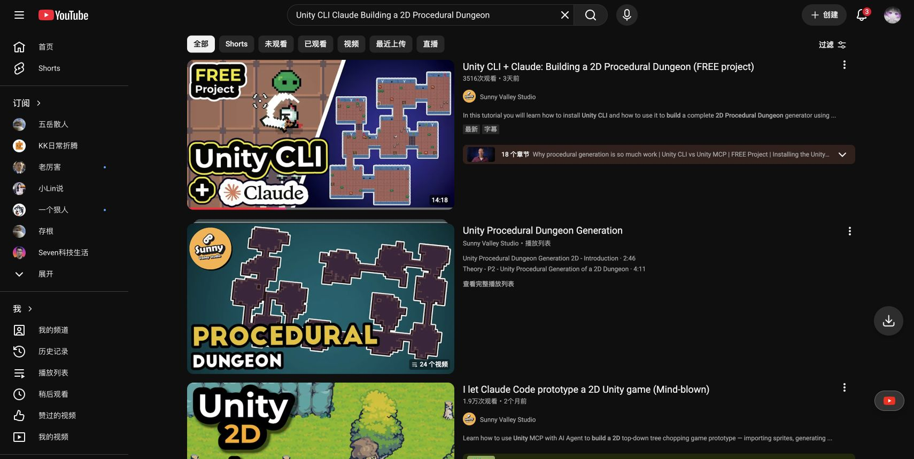
2. 点击目标视频，等待播放器与原字幕出现。
3. **Observe:** 原字幕正常显示，但 Mercury 字幕按钮、菜单和译文层均未创建。
   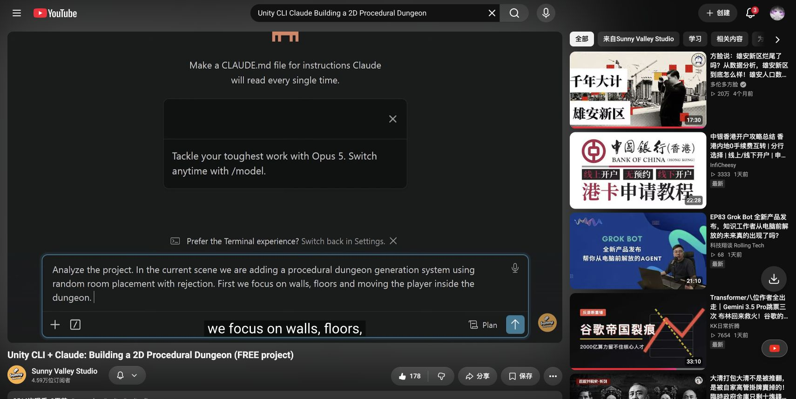

**Retry:** 返回搜索结果后再次点击同一视频，结果相同。

**Fix Status:** verified — `f778c7f`; browser re-test passed.

**After Fix:** 搜索结果点击进入视频后无需刷新即出现 Mercury 按钮与菜单。
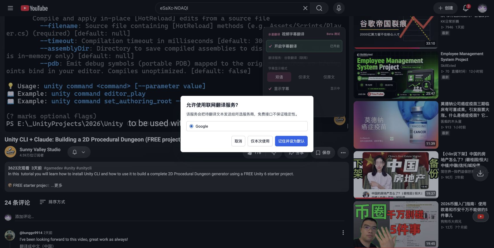

### ISSUE-004: PDF 联网服务取消会逐页重复弹窗并覆盖已有译文

| Field | Value |
|-------|-------|
| **Severity** | medium |
| **Category** | functional / privacy UX |
| **URL** | Mercury Translate PDF 阅读器 |

**Description:** 已使用 Chrome 本地翻译完成前三个可视页后，将服务切换为 Google。Mercury 会在发送前正确阻断，但一次取消只处理一个页级请求，随后第 2 页、第 3 页各再次弹出相同同意框。全部取消后，三个原本“已翻译”的页都被改成“失败”，没有保留当前结果。

**Repro Steps:**

1. 使用 Chrome 本地翻译完成 PDF 可视页。
2. 将服务切换为“Google 翻译（联网）”。
3. **Observe:** 第一次出现联网同意框。
   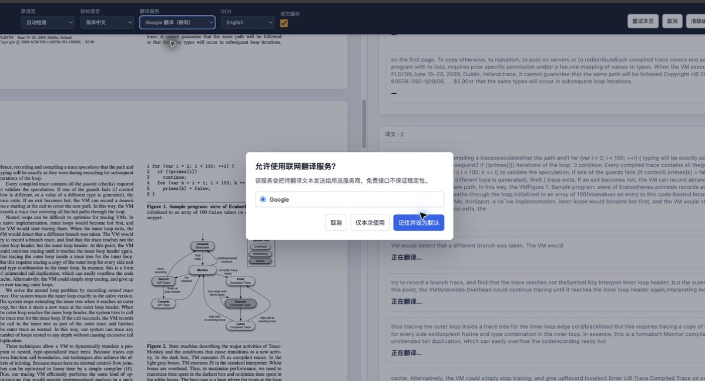
4. 点击“取消”。
5. **Observe:** 同一同意框对后续可视页再次出现；需要连续取消三次。
6. 全部取消后，原有三页译文状态均从“已翻译”变为“失败”。

**Retry:** 依次取消第 1、2、3 个页级请求，三次均可复现；未点击任何授权按钮，未发送文本。

**Fix Status:** verified — `4190c78`; browser re-test passed.

**After Fix:** 两个可视页共享一个同意决定。取消一次后四秒内没有第二个对话框，两个页面的既有中文译文仍保留；当前尝试显示“已取消”。
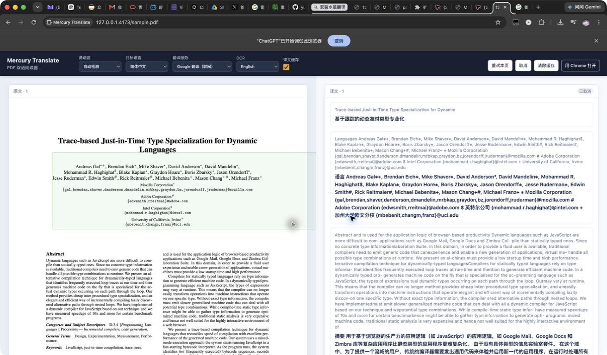

### ISSUE-005: 视频字幕取消联网同意后会重复弹窗

| Field | Value |
|-------|-------|
| **Severity** | medium |
| **Category** | privacy UX / functional |
| **URL** | YouTube 视频页 |

**Description:** 视频翻译服务为 Google 且尚未授权时，第一次字幕请求会正确显示联网同意框；原始实现中点击“取消”后，后续字幕 cue 又会重新显示。首次修复记住了取消决定，但真实浏览器回归发现首个选择尚未完成时，六个并发字幕请求会同时各创建一个对话框。未点击授权按钮，未发送文本。

**Repro Steps:**

1. 在 YouTube 视频页启用 Mercury 字幕翻译，服务选择 Google。
2. 出现联网同意框后点击“取消”。
3. 等待下一条字幕 cue。
4. **Observe:** 相同联网同意框再次出现；连续取消后仍可复现。
   

**Retry:** 暂停视频并连续取消多次，已排队请求仍重新显示同一对话框。

**First Re-test:** 最新构建在用户作出首次选择前同时创建六个对话框；依次取消六次后，等待十二秒没有新提示，说明取消抑制有效但并发合并缺失。
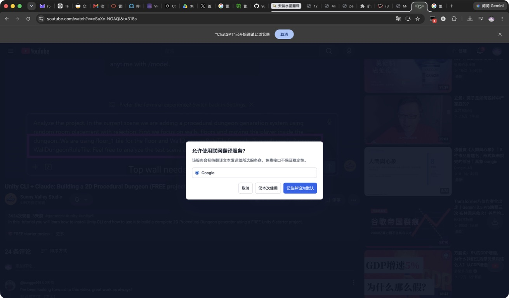

**Fix Status:** verified — `67ce8e4` + `2ba2145`; browser re-test passed.

**After Fix:** 视频继续播放并产生多条字幕时，等待八秒仍只有一个同意框；取消一次后继续播放十二秒没有再次弹出。整个测试没有授权 Google，也没有发送待翻译文本。
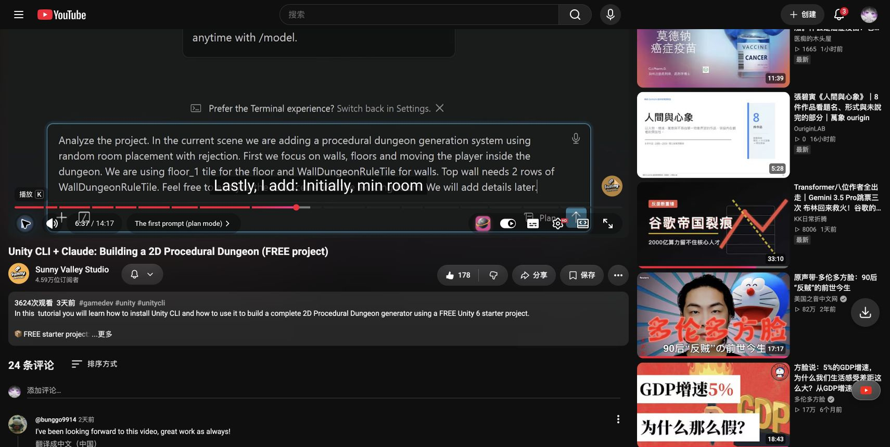

### ISSUE-002: OCR 语言包大小缺少数字

| Field | Value |
|-------|-------|
| **Severity** | low |
| **Category** | content |
| **URL** | Mercury Translate 设置 → 图片翻译 |

**Description:** 简体中文、English、繁体中文、日本語和 한국어 五个语言包都显示为“约 MB”，缺少数值。用户在下载前无法判断模型大小。切换到其他设置分类再返回后仍可复现。

**Repro Steps:**

1. 打开 Mercury Translate 完整设置。
2. 进入“图片翻译 / OCR 与语言包”。
3. **Observe:** 五项说明中的体积均缺少数字。
   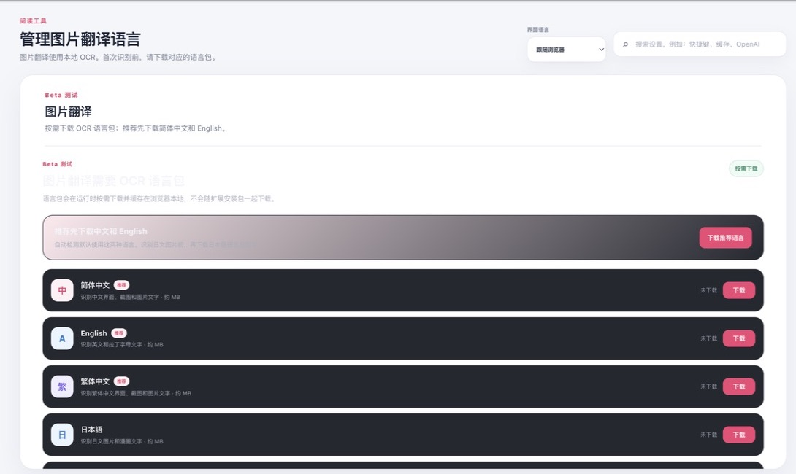

**Retry:** 切换到“通用设置”后返回，五项仍显示“约 MB”。

**Fix Status:** deferred (Standard tier does not modify low-severity issues)

### ISSUE-003: OCR 推荐语言包下载永久卡在“下载中”

| Field | Value |
|-------|-------|
| **Severity** | medium |
| **Category** | functional |
| **URL** | Mercury Translate 设置 → 图片翻译 |

**Description:** 用户明确授予 `raw.githubusercontent.com` 权限后，点击“下载简体中文和 English”，推荐下载按钮以及简体中文、English、繁体中文三个条目持续显示“下载中…”，但状态一直为“未下载”。等待超过一分钟后没有成功、失败或重试提示，因此图片 OCR 无法使用。

**Repro Steps:**

1. 在图片翻译设置点击“下载简体中文和 English”。
2. 在 Chrome 权限提示中仅允许 `raw.githubusercontent.com`。
3. 等待超过一分钟。
4. **Observe:** 三个条目保持“未下载”，对应按钮永久禁用为“下载中…”。
   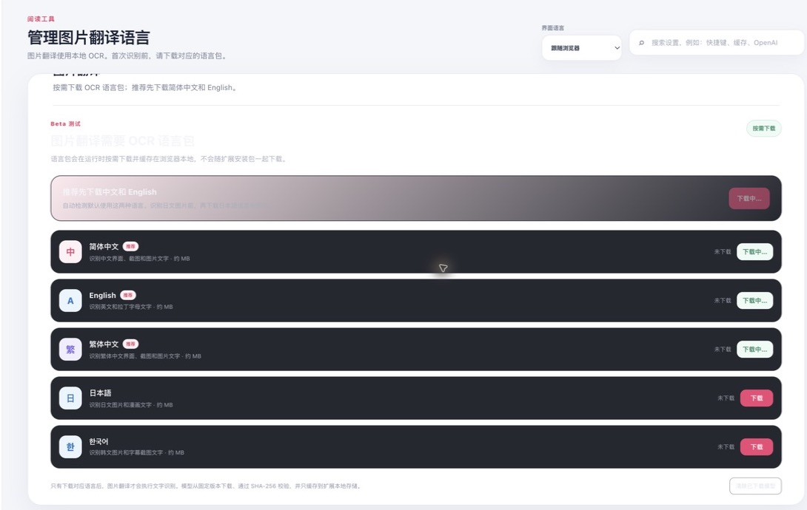

**Retry:** 继续等待 30 秒并重新读取设置状态，结果不变。

**Fix Status:** verified — `7f75f17`; browser re-test passed.

**After Fix:** 推荐的简体中文、English 与繁体中文语言包在十秒内完成下载并显示“已下载 / 已就绪”。
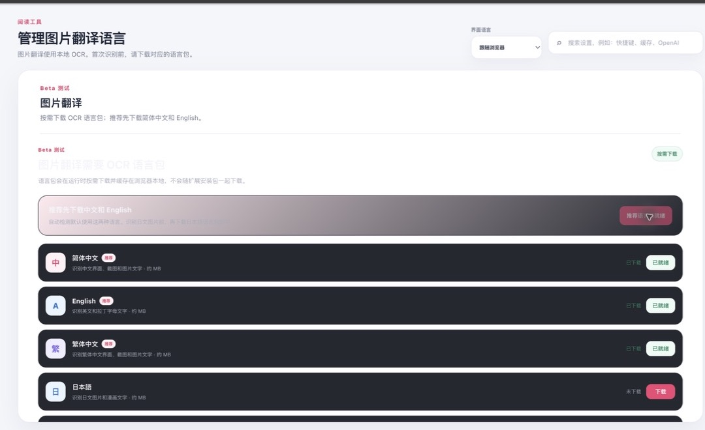

### ISSUE-006: OCR 语言包就绪后图片识别仍永久等待

| Field | Value |
|-------|-------|
| **Severity** | medium |
| **Category** | functional |
| **URL** | 本地 Mercury Translate 浏览器 QA 夹具 |

**Description:** 推荐 OCR 语言包均显示“已下载 / 已就绪”后，对包含大号清晰英文的本地图片启动翻译。界面进入“正在识别图片文字”，等待超过两分钟仍没有结果、失败提示或重试状态；页面控制台没有 Mercury 错误或警告。

**Repro Steps:**

1. 确认 English OCR 语言包状态为“已就绪”。
2. 在本地 QA 夹具点击清晰英文测试图片的翻译入口。
3. 等待超过 65 秒，并再次等待至总计超过两分钟。
4. **Observe:** 图片保持处理中，未出现 OCR 文本或错误状态。
   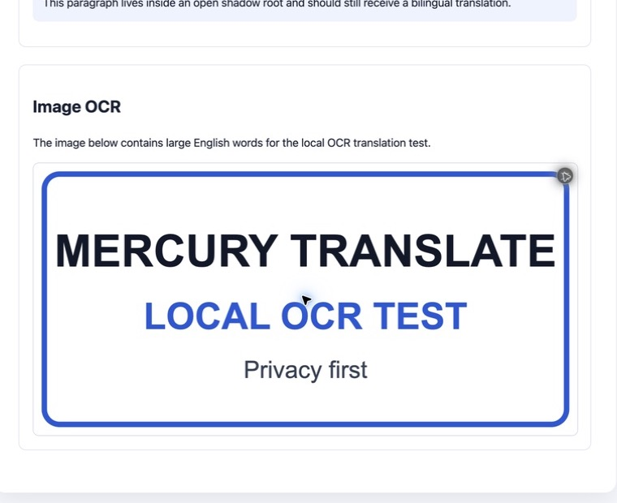

**Retry:** 分别在 15 秒、35 秒、65 秒及两分钟后检查，状态均未结束。

**Fix Status:** verified — `355ce6e`; browser re-test passed.

**After Fix:** 同一清晰英文图片在十秒内完成本地 OCR 和 Chrome 本地翻译，按钮切换为“恢复原图”，页面显示三行中文译文；修复后控制台没有新增 Mercury 错误或警告。
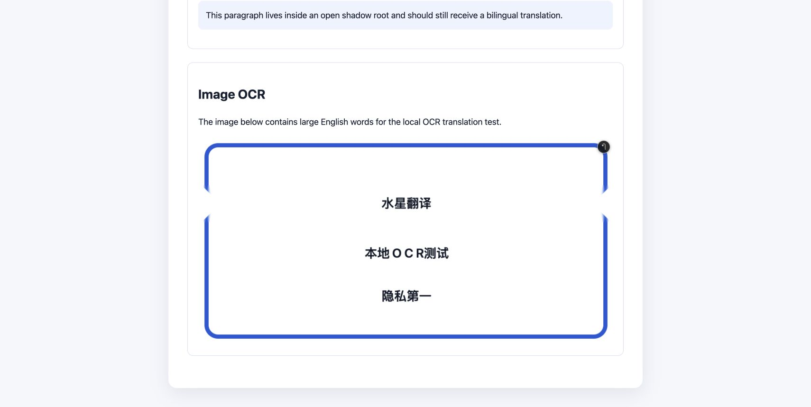

### ISSUE-007: 取消视频联网同意后控制台持续刷预翻译警告

| Field | Value |
|-------|-------|
| **Severity** | medium |
| **Category** | console / performance |
| **URL** | YouTube 视频页 |

**Description:** ISSUE-005 修复后，取消一次即可保持对话框关闭，但视频字幕前置翻译仍持续把预期的 `NetworkConsentRequiredError` 记录为 warning。真实浏览器在 43 秒内记录 100 条相同 Mercury 警告，污染控制台并产生无意义诊断开销；隐私阻断仍然有效。

**Repro Steps:**

1. 让 Google 视频翻译显示唯一联网同意框。
2. 点击“取消”，继续播放视频。
3. 等待约 43 秒并读取当前标签页 Mercury 日志。
4. **Observe:** 没有再次弹窗，但出现 100 条同类 `视频字幕前置翻译失败 NetworkConsentRequiredError` warning。

**Retry:** 所有 100 条都来自 Mercury content script，时间范围为 `02:34:54.717Z` 至 `02:35:37.442Z`，错误类型完全一致。

**Fix Status:** verified — `bdd0a8e`; browser re-test passed.

**After Fix:** 真实 YouTube 页面只显示一个联网同意框。取消一次后继续播放十五秒，界面没有再次弹窗，Mercury 控制台新增日志为 0；Google 从未获授权，也没有发送字幕文本。
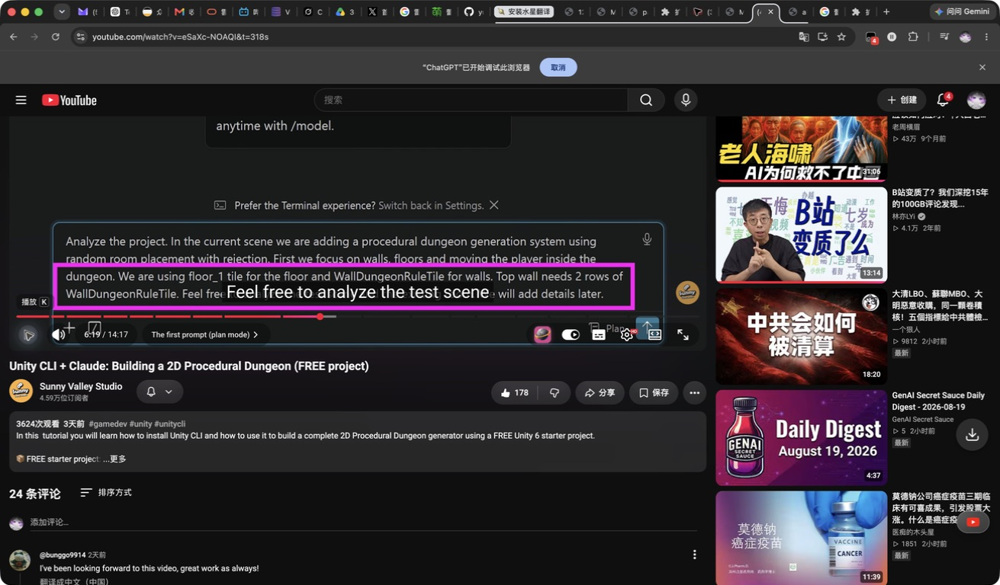

## Fixes Applied

- `f778c7f` — YouTube 单页应用导航后重新挂载字幕管线（ISSUE-001，浏览器已验证）。
- `7f75f17` — OCR 下载只缓存并校验语言资源，不在下载动作中启动识别 Worker（ISSUE-003，浏览器已验证）。
- `4190c78` — PDF 可视页共享一次联网同意决定，并在取消时保留现有译文（ISSUE-004，浏览器已验证）。
- `67ce8e4` + `2ba2145` — 记住字幕取消决定，并让所有并发 cue 共享一个待决选择（ISSUE-005，浏览器已验证）。
- `355ce6e` — 保留经哈希校验的 OCR 模型字节，只在 Tesseract 初始化时传入稳定语言代码（ISSUE-006，浏览器已验证）。
- `bdd0a8e` — 将联网同意取消与主动中止视为预期控制流，不再重复写入视频字幕 warning（ISSUE-007，浏览器已验证）。

## Regression Tests

- `5d06024` — YouTube SPA 导航后挂载字幕控件（ISSUE-001）。
- `576e012` — OCR 语言包下载不启动识别 Worker（ISSUE-003）。
- `fff07b1` — PDF 并发页共享同意决定、取消后停止队列（ISSUE-004）。
- `f945bfb` — 视频并发同意合并、取消抑制与重置竞态（ISSUE-005）。
- `77a75bd` — VM 执行 OCR shim，验证模型字节与初始化语言代码（ISSUE-006）。
- `6fa8479` — 视频字幕只为真实故障保留 warning，取消联网和主动中止不告警（ISSUE-007）。

## Ship Readiness

浏览器功能与隐私边界通过；Google 未获授权，未发生文本发送。完整代码、构建、双 ZIP 与 repo-harness 发布证据另见本工作包的最终检查记录。
